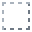

---
navigation:
  title: Wireless Router
  icon: wirelessautomate:router
  parent: index.md
  position: 2
item_ids:
  - wirelessautomate:router
---

# Wireless Router

<BlockImage id="wirelessautomate:router" p:facing="up" p:tier="basic" scale="3" float="left" />

The router attaches to a face of any block (the machine) and gives the network access to it, like
a pipe touching it would, but on **all six faces at once**: you choose on its screen what each
machine face does.

 

## Spec sheet

| | |
| --- | --- |
| **Attaches to** | Any face of any block (it needs a block behind it). |
| **Opens with** | Right-click the router, with an empty hand or a regular item. |
| **Turns with** | Shift + right-click with an empty hand: turns the router 90°. The face settings don't change. |
| **Types** | Items, Fluids, Energy and, with Mekanism, Chemicals; with Ars Nouveau, Source. |
| **Configurable faces** | All six machine faces, each with mode, priority, redstone and filter per type. |
| **Upgrades** | [Upgrade Cards](upgrade-cards.md) (use on the router) and the [Chunk Loading Upgrade](chunk-loading.md) (in the slot at the top of the screen). |
| **Starting tier** | Basic. Raised with [Upgrade Cards](upgrade-cards.md). |

## Recipe

<RecipeFor id="wirelessautomate:router" />

## Where to attach it

<GameScene zoom="4" interactive={true}>
  <Block id="minecraft:furnace" x="0" y="0" z="0" />
  <Block id="wirelessautomate:router" x="0" y="1" z="0" p:facing="up" p:tier="basic" />
  <Block id="wirelessautomate:router" x="0" y="0" z="1" p:facing="south" p:tier="basic" />
  <BlockAnnotation x="0" y="1" z="0" color="#4a8cff">
    Attached on top of the furnace
  </BlockAnnotation>
  <BlockAnnotation x="0" y="0" z="1" color="#ff9a3c">
    Attached to the side: works the same
  </BlockAnnotation>
  <IsometricCamera yaw="200" pitch="30" />
</GameScene>

It doesn't matter which face it sits on: from its screen it reaches all six. Breaking the block
behind it drops the router.

## Setting up a face

| Step | How |
| --- | --- |
| **1. Pick the type** | Click the tab: Items, Fluids, Energy, Chemicals or Source. |
| **2. Pick the face** | Click the machine face on the 3D model (drag to rotate), or use the U N E D S W buttons (Up, North, East, Down, South, West). |
| **3. Pick the mode** | Extract, Insert, Storage or None (table below). |
| **4. Settings (optional)** | Under **More**: priority and redstone. Under **Edit**: the face's [filter](filters.md). |
| **5. Network (optional)** | In the selector next to the tabs, pick this tab's [network](networks.md). |

Drag the right edge, the bottom edge or the corner to make the screen bigger; the 3D view grows. When space is short, the tabs show only their icon (hover for the name).

## Face modes

| Mode | What it does | Use it for |
| --- | --- | --- |
|  **Extract** | Takes resources out of the machine through this face. | Outputs: finished furnace, generator, miner. |
|  **Insert** | Puts resources into the machine through this face. | Inputs: furnace, processing machine, final chest. |
|  **Storage** | Receives from extractors and delivers to inserters, but doesn't trade with another Storage. | Buffer and storage chests. |
|  **None** | The face is left out. | Faces you don't need. |

## Priority and redstone

| Setting | Values | Effect |
| --- | --- | --- |
| **Priority** | −999 to 999 (default 0) | Higher-priority destinations receive first; ties take turns. |
| **Redstone: Ignore** | Default | The face always works. |
| **Redstone: With signal** | | The face only works with a redstone signal on the router. |
| **Redstone: No signal** | | The face only works without a signal. |

## Specs per tier

<Row gap="12">
  <ItemImage id="wirelessautomate:router" scale="2" components="minecraft:block_state={tier:'basic'}" />
  <ItemImage id="wirelessautomate:router" scale="2" components="minecraft:block_state={tier:'advanced'}" />
  <ItemImage id="wirelessautomate:router" scale="2" components="minecraft:block_state={tier:'elite'}" />
  <ItemImage id="wirelessautomate:router" scale="2" components="minecraft:block_state={tier:'emerald'}" />
  <ItemImage id="wirelessautomate:router" scale="2" components="minecraft:block_state={tier:'ultimate'}" />
</Row>

Throughput is **per face and per type**, counted at the sender. Chemicals use the fluid limit.
Your server may use different values: the upgrade card's tooltip shows yours.

| Tier | Items/s | Fluid and chemical (mB/s) | Energy (FE/t) | Source/s | Range |
| --- | --- | --- | --- | --- | --- |
| **Basic** | 32 | 2,000 | 1,000 | 100 | 64 blocks |
| **Advanced** | 256 | 16,000 | 8,000 | 800 | 512 blocks |
| **Elite** | 2,048 | 128,000 | 64,000 | 6,400 | The whole dimension |
| **Emerald** | 16,384 | 1,024,000 | 512,000 | 51,200 | Every dimension |
| **Allthemodium¹** | 131,072 | 8,192,000 | 4,096,000 | 409,600 | Every dimension |
| **Vibranium¹** | 1,048,576 | 65,536,000 | 32,768,000 | 3,276,800 | Every dimension |
| **Unobtainium¹** | 8,388,608 | 524,288,000 | 262,144,000 | 26,214,400 | Every dimension |
| **Ultimate** | Unlimited | Unlimited | Unlimited | Unlimited | Every dimension |

¹ Only with the Allthemodium mod. Source only with Ars Nouveau.

<GameScene zoom="3" interactive={true}>
  <Block id="minecraft:chest" x="0" y="0" z="0" />
  <Block id="wirelessautomate:router" x="0" y="1" z="0" p:facing="up" p:tier="basic" />
  <Block id="minecraft:furnace" x="2" y="0" z="0" />
  <Block id="wirelessautomate:router" x="2" y="1" z="0" p:facing="up" p:tier="advanced" />
  <Block id="minecraft:barrel" x="4" y="0" z="0" p:facing="up" />
  <Block id="wirelessautomate:router" x="4" y="1" z="0" p:facing="up" p:tier="elite" />
  <Block id="minecraft:smoker" x="6" y="0" z="0" />
  <Block id="wirelessautomate:router" x="6" y="1" z="0" p:facing="up" p:tier="emerald" />
  <Block id="minecraft:blast_furnace" x="8" y="0" z="0" />
  <Block id="wirelessautomate:router" x="8" y="1" z="0" p:facing="up" p:tier="ultimate" />
  <BlockAnnotation x="0" y="1" z="0" color="#c8ccd2">
    Basic
  </BlockAnnotation>
  <BlockAnnotation x="2" y="1" z="0" color="#e2b347">
    Advanced
  </BlockAnnotation>
  <BlockAnnotation x="4" y="1" z="0" color="#45d6cc">
    Elite
  </BlockAnnotation>
  <BlockAnnotation x="6" y="1" z="0" color="#2fdc62">
    Emerald
  </BlockAnnotation>
  <BlockAnnotation x="8" y="1" z="0" color="#a06bff">
    Ultimate
  </BlockAnnotation>
  <IsometricCamera yaw="200" pitch="30" />
</GameScene>

In creative, middle-click picks the router in the block's tier.
